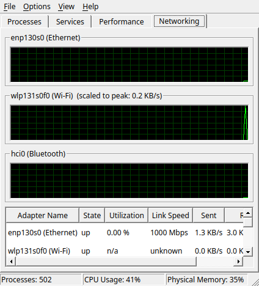

# NT Task Manager

A system monitor in the shape of the Windows NT 4.0 task manager:
processes with CPU and memory usage, a button to end them, the services
of the system, load meters and network throughput.


Meant as a companion to the Plasma theme
[NT Legacy](—https://github.com/huppiflupp/nt-legacy) but it runs
independently and then simply looks like the rest of your desktop.

---

## The program draws nothing by itself

This is the one decision everything else follows from.

There is no stylesheet in this source, no palette set, no colours of its
own and no hand-painted frames. Everything that makes the window look
like Windows NT — the sunken table, the 3D column headers, the tab bar,
the three-part status line — comes from the **widget style** of the
system. The NT Legacy theme sets `widgetStyle=Windows`, and the Qt style
of that name draws exactly these shapes.

What that buys: the window changes colour world with you when you switch
the theme from teal to desert or to a night variant. Without a line of
code for it.

The price, paid knowingly: under Breeze it looks like Breeze. A program
that forces its appearance fits exactly once — and never again after
that.

## Dependencies

Exactly one: **Qt 6** (Widgets and DBus).

`libksysguard` for the processes and `libtaskmanager` for the window list
would be the obvious choices, and both sit on every Plasma system. They
are not needed. systemd speaks D-Bus, and D-Bus is part of Qt. The
process data lives in `/proc`, and the formats are fixed in `proc(5)`.

## Building and installing

```bash
cmake -B build -DCMAKE_BUILD_TYPE=Release
cmake --build build
./build/nt-taskmanager
```

On Fedora this needs `qt6-qtbase-devel`, and nothing else. To install:

```bash
sudo cmake --install build                    # into /usr/local
cmake --install build --prefix ~/.local       # or into your home
```

Either way the program, the `.desktop` file and the AppStream metadata
are placed; *Task Manager* then appears in the application launcher.

### As an RPM

```bash
./packaging/make-rpm.sh              # builds from the current state
./packaging/make-rpm.sh --lint       # plus rpmlint, if it is installed
sudo dnf install ~/rpmbuild/RPMS/x86_64/nt-taskmanager-*.rpm
```

The script wraps the source archive with `git archive`, so only what is
actually in the repository ends up in it — no forgotten `build/`
directory. The spec file lives in `packaging/`.

Every tagged version also carries a built RPM on its
[release page](https://github.com/huppiflupp/nt-taskmanager/releases).

The package depends on nothing but Qt6. In particular there is **no**
`Requires` on NVML or a graphics driver: the library is loaded at
runtime, and where it is missing the tab shows *no adapter* instead of
failing. A hard `Requires` would have limited the package to machines
with the NVIDIA driver installed.

### Command line options

| Option | Effect |
|---|---|
| `--on-top` | keep the window above others (see below) |
| `--tab <n>` | which tab the window opens with, `0` being *Processes* |
| `--image <file>` | build the window, measure once, take a picture, quit |

`--image` is how the pictures in this file are made. On the way out it
writes the key figures to standard output, so the numbers in the window
can be checked against something:

```
$ ./build/nt-taskmanager --image x.png
Processes: 502  CPU: 41 %  Memory: 35 %  Services: 239
```

## What is in it

| Tab | Contents |
|---|---|
| **Processes** | name, user, CPU load, memory, PID. Sortable, ends processes. |
| **Services** | the systemd units of type `.service` with description and status. |
| **Performance** | processor, graphics card and memory as a bar with a graph. |
| **Networking** | Ethernet, Wi-Fi and Bluetooth: one graph each, table below. |




In the menu: *New Task (Run…)*, *Always On Top*, *Refresh Now* (F5) and
the speed steps *High / Normal / Low / Paused*. Not carried over are
*Minimize On Use* and *Hide When Minimized* — both are governed by the
window manager under Plasma, and no program should take that upon itself.

About the CPU column: the values add up to 100 % across all processes,
not to 100 % per core. That is how the Windows task manager counted;
`top` does it the other way round, and anyone running both side by side
should know why the numbers differ.

Processes are ended with `SIGTERM`, not `SIGKILL` — the process should be
allowed to clean up. If it belongs to another user, the call goes through
`pkexec`, which opens the authentication dialog of the system.

## The graphics card

The one row in the Performance tab that did not exist in 1996.

| Vendor | Source |
|---|---|
| NVIDIA | NVML (`libnvidia-ml`), loaded at runtime |
| AMD | `/sys/class/drm/cardN/device/gpu_busy_percent` |
| Intel | missing — see below |

NVML is fetched with `dlopen` rather than linked against: otherwise the
program would refuse to start on any machine without the NVIDIA driver,
and that is most of them. The two structs it needs are declared by hand,
because the NVML header only ships with the CUDA toolkit — verified
against the library, the value matches `nvidia-smi` to the per cent.

Intel is missing on purpose: its utilisation sits behind the i915 PMU,
which is not readable without elevated privileges. A system monitor that
asks for a password in order to draw a bar would be the wrong answer.

## The network

Three kinds of adapter, three sources:

| | Counters | State, speed |
|---|---|---|
| Ethernet, Wi-Fi | `/proc/net/dev` | `/sys/class/net/…` |
| Bluetooth | `ioctl HCIGETDEVINFO` | the same `ioctl` |

Bluetooth does not appear in `/proc/net/dev` — at most `bnep0` would show
there, and only while a PAN connection exists. The adapter counters
therefore come from the same `ioctl` that `hciconfig` uses; it needs no
elevated privileges. The struct is declared by hand (the header belongs
to `bluez-libs-devel`) and checked against `hciconfig`: RX 2,988,490 and
TX 30,409, equal to the byte.

Utilisation in per cent exists only where a link speed is reported — for
Ethernet, that is, but not for Wi-Fi or Bluetooth. There the graph scales
to the highest rate seen so far and says so in its title; without that
note a spike at 100 % would look like a saturated link, when it only
means "more than ever before".

## Why green on black

Bars and graphs are the one place where the program does draw for itself
— no widget style provides them. Their colours therefore do **not**
follow the colour scheme; they stay green on black.

That is not an oversight: Windows did the same. Window colours followed
the scheme, the meters in the task manager stayed green. Tinting them
loses exactly the picture everyone recognises.

The frame around them does come from the style (`QStyle::PE_Frame`), so
the recess matches every table in the window.

## Always On Top under Wayland

`Qt::WindowStaysOnTopHint` has no effect under Wayland: the protocol has
no notion of "always on top", a window fundamentally cannot decide its
own place in the stack there.

The window manager can. KWin accepts instructions over D-Bus, so the
program loads a tiny script that finds its own window by process id and
sets `keepAbove`. Under X11 the window flag still suffices.

The same thing is available as a start option: `--on-top`.

## What is not in it

**Applications.** The tab with the window list is missing, and there is a
technical reason: under X11 it would be three lines (`_NET_CLIENT_LIST`),
under Wayland that route is gone. The window list would only be reachable
through a KWin script loaded into the window manager over D-Bus and
reporting back — too much machinery for the benefit.

## Where things are

| File | Responsible for |
|---|---|
| `src/mainwindow.*` | window, tabs, menu, status bar |
| `src/processreader.*` | reading `/proc`: processes, CPU load, memory |
| `src/processmodel.*` | the process table as a Qt model |
| `src/servicemodel.*` | systemd units over D-Bus |
| `src/performancepage.*` | the *Performance* tab |
| `src/networkreader.*` | `/proc/net/dev`, sysfs and the Bluetooth `ioctl` |
| `src/networkpage.*` | the *Networking* tab |
| `src/meters.*` | bar and graph — the only thing drawn by hand |
| `src/gpureader.*` | NVML and the AMD sysfs route |

The readers measure, the pages display. Whoever wants to add another
quantity writes a reader and hangs it on a page — measuring does not
belong in the drawing code.

Every number is produced **once per tick** and passed on, not read again
at each place that shows it. Otherwise the same window would carry two
values for the same quantity, differing by a per cent.

## What has been checked

No automated tests, but every number is checked against an existing tool
— on the same machine, in the same time window:

| Value | ours | cross-check |
|---|---|---|
| Processes | 512 | `ps ax` → 512 |
| Services | 240 | `systemctl` → 240 |
| Memory | 54 % | `free` → 54 % |
| CPU | 47 % | `top` → 46 % |
| Process time | 78 s | `ps -o cputimes` → 78 s |
| GPU load | 33 % | `nvidia-smi` → 33 % |
| Bluetooth RX/TX | 2,988,490 / 30,409 | `hciconfig` → equal |

## Traps already paid for

In case anyone builds on this — these are the places that quietly compute
the wrong thing instead of failing:

- **`QFile::atEnd()` is useless on `/proc` and `/sys`.** Those files
  report a size of 0, so `atEnd()` says yes before the first read and the
  loop runs zero times. Always `readAll()`.
- **The process name in `comm` is capped at 15 characters.**
  `plasma-systemmonitor` becomes `plasma-systemmo`. The name therefore
  comes from the `exe` symlink.
- **`QFileInfo::exists()` follows the symlink.** For foreign processes
  without read permission it says no as well — kernel threads are
  recognised by an empty `cmdline`, not by a missing `exe`.
- **The name in `/proc/PID/stat` may contain parentheses and spaces**
  ("(Web Content)"). Parsing therefore continues after the *last* closing
  parenthesis.
- **`MemFree` is not the memory in use.** Computed from `MemFree` a
  healthy system reported 95 % usage; the right field is `MemAvailable`.
- **`Qt::WindowStaysOnTopHint` has no effect under Wayland** — see above.

## Licence

GPL-2.0-or-later. The program contains no third-party material.
