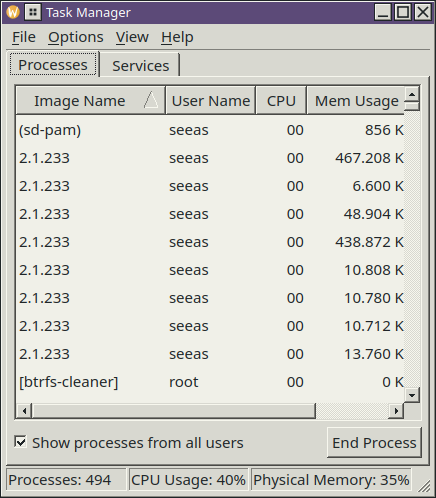
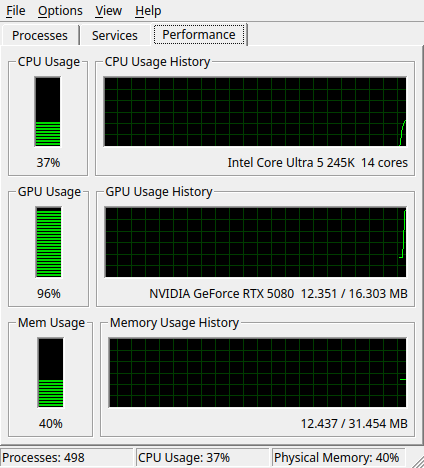
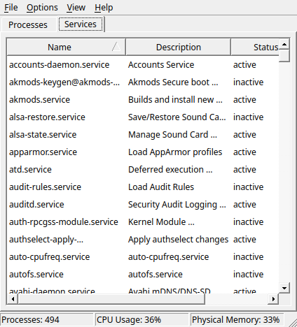

# NT Task Manager

Ein Systemmonitor in der Form des Windows-NT-4.0-Taskmanagers: Prozesse
mit CPU-Last und Speicherbelegung, Beenden per Knopf, und die Dienste des
Systems.



Gedacht als Beiwerk zum Plasma-Design
[NT Legacy](https://github.com/huppiflupp/NiceOS9-theme) — es läuft aber
unabhängig davon und sieht dann eben aus wie der Rest deines Desktops.

---

## Das Programm zeichnet nichts selbst

Das ist die eine Entscheidung, aus der alles andere folgt.

Es gibt in diesem Quelltext kein Stylesheet, keine gesetzte Palette, keine
eigenen Farben und keine gemalten Rahmen. Alles, was das Fenster nach
Windows NT aussehen lässt — die versenkte Tabelle, die 3D-Spaltenköpfe,
die Reiterleiste, die dreigeteilte Statuszeile — kommt vom **Widget-Stil**
des Systems. Das Design NT Legacy setzt `widgetStyle=Windows`, und der
Qt-Stil dieses Namens zeichnet genau diese Formen.

Der Gewinn: Das Fenster wechselt die Farbwelt mit, wenn du im Design von
Petrol auf Wüste oder auf eine Nachtfassung umschaltest. Ohne eine Zeile
Code dafür.

Der Preis, und der ist bewusst bezahlt: Unter Breeze sieht es aus wie
Breeze. Ein Programm, das sein Aussehen erzwingt, passt genau einmal — und
danach nie wieder.

## Abhängigkeiten

Genau eine: **Qt 6** (Widgets und DBus).

Naheliegend wären `libksysguard` für die Prozesse und `libtaskmanager` für
die Fensterliste; beide liegen auf jedem Plasma-System. Gebraucht werden
sie nicht. systemd spricht D-Bus, und D-Bus steckt in Qt. Die Prozessdaten
stehen in `/proc`, und die Formate sind in `proc(5)` festgeschrieben.

## Bauen

```bash
cmake -B build -DCMAKE_BUILD_TYPE=Release
cmake --build build
./build/nt-taskmanager
```

Auf Fedora braucht es dafür `qt6-qtbase-devel`.

Für Bilder wie die oben:

```bash
./build/nt-taskmanager --bild fenster.png        # Processes
./build/nt-taskmanager --reiter 1 --bild x.png   # Services
```

Der Schalter baut das Fenster auf, misst einmal, fotografiert und
beendet. Nebenbei schreibt er die Kennzahlen auf die Standardausgabe —
so lässt sich nachrechnen, ob die Zahlen im Fenster stimmen.

## Was drin ist

| Reiter | Inhalt |
|---|---|
| **Processes** | Name, Benutzer, CPU-Last, Speicher, PID. Sortierbar, Prozess beenden. |
| **Services** | Die systemd-Units vom Typ `.service` mit Beschreibung und Status. |
| **Performance** | Prozessor, Grafikkarte und Arbeitsspeicher als Balken mit Verlauf. |
| **Networking** | Ethernet, WLAN und Bluetooth: je ein Verlauf, darunter die Tabelle. |



Im Menü: *New Task (Run…)*, *Always On Top*, *Refresh Now* (F5) und die
Taktstufen *High / Normal / Low / Paused*. Nicht übernommen sind
*Minimize On Use* und *Hide When Minimized* — beides regelt unter Plasma
der Fenstermanager, und kein Programm sollte sich das selbst nehmen.



Zur CPU-Spalte: Die Werte summieren sich über alle Prozesse auf 100 %,
nicht auf 100 % je Kern. So macht es der Windows-Taskmanager; `top` macht
es andersherum, und wer beide nebeneinander laufen lässt, sollte wissen
warum die Zahlen auseinandergehen.

Beendet wird mit `SIGTERM`, nicht `SIGKILL` — der Prozess soll aufräumen
dürfen. Gehört er einem anderen Benutzer, läuft der Aufruf über `pkexec`,
das den Authentifizierungsdialog des Systems öffnet.

## Die Grafikkarte

Die einzige Zeile im Performance-Reiter, die es 1996 nicht gab.

| Hersteller | Weg |
|---|---|
| NVIDIA | NVML (`libnvidia-ml`), zur Laufzeit nachgeladen |
| AMD | `/sys/class/drm/cardN/device/gpu_busy_percent` |
| Intel | fehlt — siehe unten |

NVML wird mit `dlopen` geholt und nicht dazugelinkt: Sonst liefe das
Programm auf keinem Rechner ohne NVIDIA-Treiber, und das sind die
meisten. Die beiden benötigten Strukturen sind selbst deklariert, weil
der NVML-Header nur im CUDA-Werkzeugkasten liegt — gegen die Bibliothek
geprüft, der Wert deckt sich aufs Prozent mit `nvidia-smi`.

Intel fehlt mit Absicht: Die Auslastung liegt dort hinter dem i915-PMU,
das ohne erhöhte Rechte nicht lesbar ist. Ein Systemmonitor, der nach dem
Passwort fragt, um einen Balken zu zeichnen, wäre die falsche Antwort.

## Warum grün auf schwarz

Balken und Verlauf sind die eine Stelle, an der das Programm doch selbst
zeichnet — die liefert kein Widget-Stil. Ihre Farben folgen deshalb
**nicht** dem Farbschema, sondern bleiben grün auf schwarz.

Das ist kein Versehen: Windows hat es genauso gehalten. Die Fensterfarben
folgten dem eingestellten Schema, die Anzeigen im Taskmanager blieben
grün. Wer sie einfärbt, verliert genau das Bild, das jeder kennt.

Der Rahmen um beide kommt dagegen sehr wohl vom Stil
(`QStyle::PE_Frame`), damit die Vertiefung dieselbe ist wie an jeder
Tabelle im Fenster.

## Das Netzwerk

Drei Arten von Adapter, drei Quellen:

| | Zähler | Zustand, Geschwindigkeit |
|---|---|---|
| Ethernet, WLAN | `/proc/net/dev` | `/sys/class/net/…` |
| Bluetooth | `ioctl HCIGETDEVINFO` | dasselbe `ioctl` |

Bluetooth taucht in `/proc/net/dev` nicht auf — dort stünde allenfalls
`bnep0`, und auch das nur, solange gerade eine PAN-Verbindung besteht.
Die Zähler des Adapters holt deshalb dasselbe `ioctl`, das auch
`hciconfig` benutzt; es braucht keine erhöhten Rechte. Die Struktur ist
selbst deklariert (der Header gehört zu `bluez-libs-devel`) und gegen
`hciconfig` geprüft: RX 2 988 490 und TX 30 409, auf das Byte gleich.

Die Auslastung in Prozent gibt es nur, wo eine Linkgeschwindigkeit
gemeldet wird — bei Ethernet also, bei WLAN und Bluetooth nicht. Dort
skaliert der Verlauf auf die höchste bisher gesehene Rate und schreibt
das in den Titel; ohne diesen Hinweis sähe eine Spitze bei 100 % nach
einer ausgelasteten Leitung aus, und sie heißt nur „so viel wie noch
nie".

## Always On Top unter Wayland

`Qt::WindowStaysOnTopHint` bleibt unter Wayland wirkungslos: Das
Protokoll kennt kein „immer oben", ein Fenster kann seine Lage im Stapel
dort grundsätzlich nicht selbst bestimmen.

Der Fenstermanager kann es sehr wohl. KWin nimmt dafür Anweisungen über
D-Bus entgegen, also lädt das Programm ein winziges Skript, das sein
eigenes Fenster an der Prozesskennung erkennt und `keepAbove` setzt.
Unter X11 genügt weiterhin die Fensterfahne.

Als Startoption gibt es dasselbe: `--obenauf`.

## Was nicht drin ist

**Applications.** Der Reiter mit der Fensterliste fehlt, und das hat einen
technischen Grund: Unter X11 wäre er drei Zeilen (`_NET_CLIENT_LIST`),
unter Wayland gibt es diesen Weg nicht mehr. Die Fensterliste käme dort
nur über ein KWin-Skript, das man per D-Bus in den Fenstermanager lädt und
das sich zurückmeldet — für den Nutzen zu viel Maschinerie.

## Lizenz

GPL-2.0-or-later.
